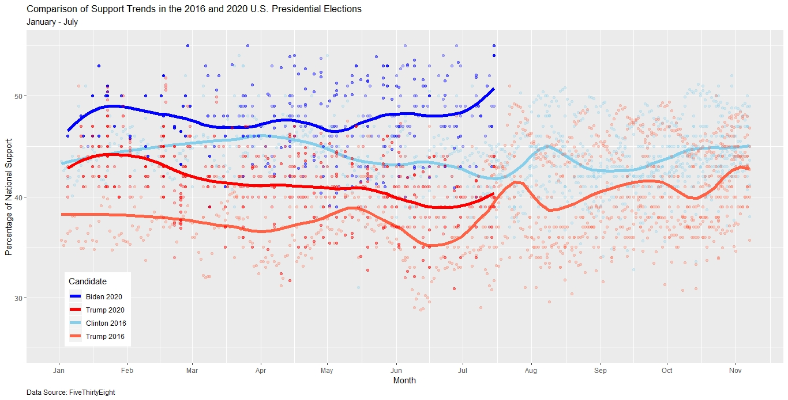

Comparison of National Support Trends in Presidential Elections: 2016 vs. 2020
==============================================================================

I first installed the necessary data manipulation and graphing packages
and then formatted the data such that I had data from January until
November of 2016 and from January until the current month of 2020.

    library(plyr)
    library(tidyr)
    library(ggplot2)

    # Clean and format 2016 polling data
    polls_2016 = data.frame(read.csv('http://projects.fivethirtyeight.com/general-model/president_general_polls_2016.csv', stringsAsFactor = FALSE))
    polls_2016 = polls_2016[which(polls_2016$type == "polls-only"),]
    polls_2016 = polls_2016[which(polls_2016$state == "U.S."),]
    polls_2016 = polls_2016[c("enddate", "rawpoll_clinton", "rawpoll_trump")]
    polls_2016$enddate = as.numeric(as.POSIXct(polls_2016$enddate, format="%m/%d/%Y"))
    polls_2016$enddate = as.Date(as.POSIXct(polls_2016$enddate, origin="1970-01-01"))
    polls_2016 = polls_2016[which((polls_2016$enddate > "2016-01-01") & (polls_2016$enddate < "2016-11-08")),]
    polls_2016$enddate = format(polls_2016$enddate, format = "%m-%d")
    polls_2016$enddate = as.Date(as.POSIXct(polls_2016$enddate, origin="2020-01-01", format = "%m-%d"))
    polls_2016 = drop_na(polls_2016)

    # Clean and format 2020 polling data
    polls_2020 = data.frame(read.csv('https://projects.fivethirtyeight.com/polls-page/president_polls.csv', stringsAsFactor = FALSE))
    polls_2020 = polls_2020[which(polls_2020$state == ""),]
    polls_2020$end_date = as.numeric(as.POSIXct(polls_2020$end_date, format="%m/%d/%y"))
    polls_2020$end_date = as.Date(as.POSIXct(polls_2020$end_date, origin="1970-01-01"))
    polls_2020 = polls_2020[which((polls_2020$end_date > "2020-01-01") & (polls_2020$end_date < Sys.Date())),]
    polls_2020_trump = polls_2020[which(polls_2020$candidate_name == "Donald Trump"),]
    polls_2020_trump$pct_trump = polls_2020_trump$pct
    polls_2020_biden = polls_2020[which(polls_2020$candidate_name == "Joseph R. Biden Jr."),]
    polls_2020_biden$pct_biden = polls_2020_biden$pct
    polls_2020 = data.frame(join(polls_2020_trump, polls_2020_biden, by = "poll_id"))
    polls_2020 = polls_2020[c("end_date", "pct_trump", "pct_biden")]
    polls_2020$end_date = as.Date(as.POSIXct(polls_2020$end_date, origin="2020-01-01", format = "%m-%d"))
    polls_2020 = drop_na(polls_2020)

Next, I used smoothed lines to draw a general trend for the candidates’
comparative support and colored and labeled the graphs appropriately.

    ### Plotting the data from 2016 to November and the data from 2020 to the current date, smoothing over approximately 2 months
    ggplot() + geom_point(data = polls_2016, aes(x = enddate, y = rawpoll_clinton), col = 'skyblue', alpha = 0.25) + # Clinton 2016 individual poll dots
        stat_smooth(data = polls_2016, aes(x = enddate, y = rawpoll_clinton, col = 'skyblue'), span = 1/5, method = 'loess', se = FALSE, size = 2) + # Clinton 2016 trend line
        geom_point(data = polls_2016, aes(x = enddate, y = rawpoll_trump, col = 'tomato'), col = 'tomato', alpha = 0.25) + # Trump 2016 individual poll dots
        stat_smooth(data = polls_2016, aes(x = enddate, y = rawpoll_trump, col = 'tomato'), span = 1/5, method = 'loess', se = FALSE, size = 2) + # Trump 2016 trend line
        geom_point(data = polls_2020, aes(x = end_date, y = pct_biden, col = 'blue'), col = 'blue', alpha = 0.25) + # Biden 2020 individual poll dots
        stat_smooth(data = polls_2020, aes(x = end_date, y = pct_biden, col = 'blue'), span = 1/3, method = 'loess', se = FALSE, size = 2) + # Biden 2020 trend line
        geom_point(data = polls_2020, aes(x = end_date, y = pct_trump, col = 'red'), col = 'red', alpha = 0.25) + # Trump 2020 individual poll dots
        stat_smooth(data = polls_2020, aes(x = end_date, y = pct_trump, col = 'red'), span = 1/3, method = 'loess', se = FALSE, size = 2) + # Trump 2020 trend line
        scale_x_date(date_breaks = "1 month", date_labels = "%b") + ylim(25, 55) + # Make the axes display 1-month intervals and the interval [25, 55] for support
        labs(x = 'Month', y = 'Percentage of National Support', title = 'Comparison of Support Trends in the 2016 and 2020 U.S. Presidential Elections', subtitle = 'January - July', caption = 'Data Source: FiveThirtyEight') + 
        scale_color_identity(guide = 'legend', name = 'Candidate', labels = c('Biden 2020', 'Trump 2020', 'Clinton 2016', 'Trump 2016')) + 
        theme(legend.position = c(0.05, 0.05), legend.justification = c('left', 'bottom'), plot.caption = element_text(hjust = 0))

